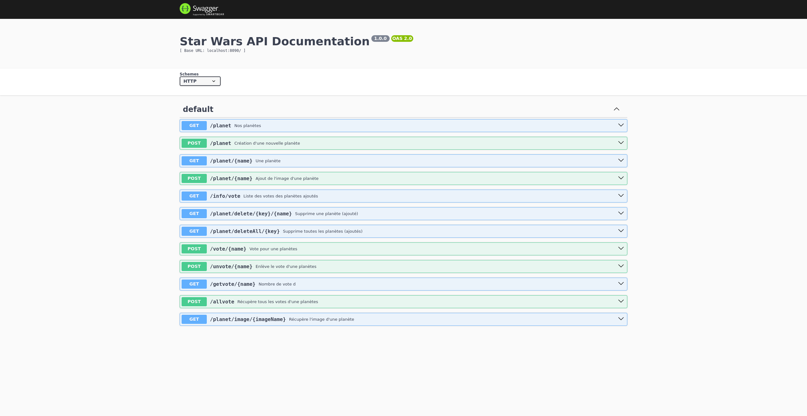
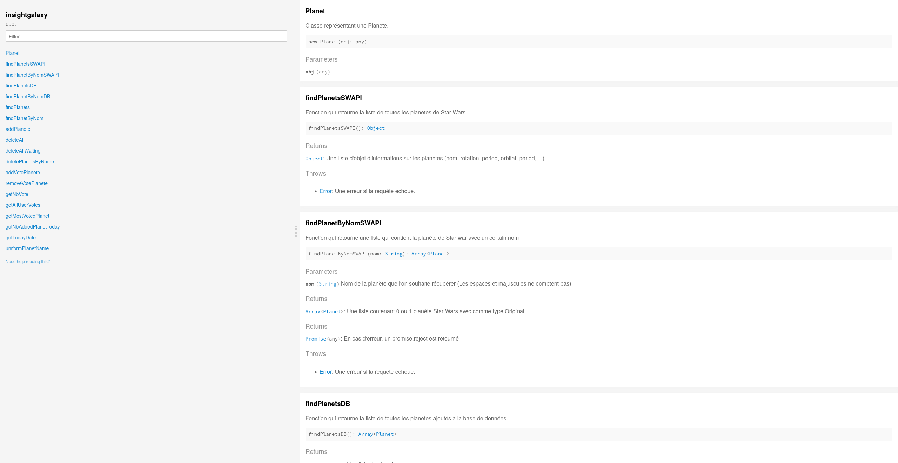

## Sommaire

1. [Serveur Express](#serveur-express)
2. [Structure](#structure)
3. [Accèder au serveur et ces données](#accèder-au-serveur-et-ces-données)
4. [Mettre à jour la documentation des Routes avec Swagger](#mettre-à-jour-la-documentation-des-routes-avec-swagger)
5. [Accéder à la documentation des Fonctions avec JsDoc](#accéder-à-la-documentation-des-fonctions-avec-jsdoc)

# Serveur Express

Ce serveur nous permet l'interraction avec notre API SWAPI et notre base de données.

<br>

Installation des packages nécessaires et de ses dépendances :

```
npm i
```

<br>
Démarrage du serveur :

```
npm start
```

# Structure
```shell
.
├── assets
│   ├── alderaan.png
│   ...
│   └── zolan.png
├── const.mjs // Constantes fixes, comme le nb de planètes max ajoutés par jour ou le token administrateur
├── package.json
├── PlaneteDAO.mjs // Dao, servant principalement à accéder la BDD
├── README.md
├── server.mjs // Serveur express utilisant le DAO
├── swagger-autogen.mjs // Script de génération de la documentation swagger
├── swagger.json
└── test
    ├── test_PlanetDAO.mjs // Tests du fonctionnement du serveur
    └── test_server.mjs // Tests des routes
```
*La représentation est simplifiée*

## Accèder au serveur et ces données

Le serveur express nous permet via des liens, d'interagir avec notre dao (qui, lui, récupére les données de l'API et de notre base de données) :

```/planet``` : Nous renvoie la liste de toutes les planètes de notre applications (SWAPI + BD).<br>
```/planet/nomPlanet``` : Nous renvoie la planète qui possède le nom exacte de **nomPlanet** <br>
...

### **Si vous souhaitez voir toutes les routes, à jour et les tester, accédez *Directement* à la documentation Swagger :**
#### http://localhost:8090/documentation-route


## Mettre à jour la documentation des Routes avec Swagger 
```
npm run start-gendoc
```

( à effectuer en étant dans le dossier API )

<br>

Adresse de la documentation Swagger : ```http://localhost:8090/documentation-route```




*Visualisation de la documentation swagger*

## Accéder à la documentation des Fonctions avec JsDoc

Adresse de la documentation JsDoc : ```http://localhost:8090/documentation-js```

<br>



*Visualisation de la documentation JsDoc*

<br>

[***Une description plus générale de notre projet est disponible sur le README du git***](../README.md)

