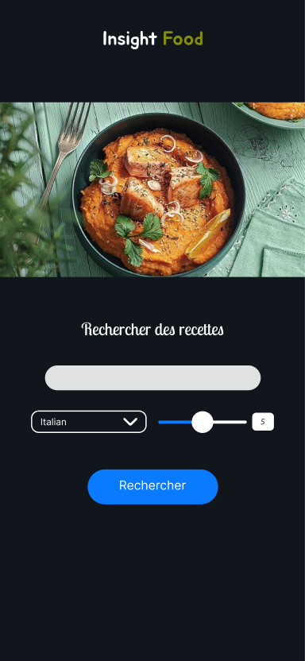
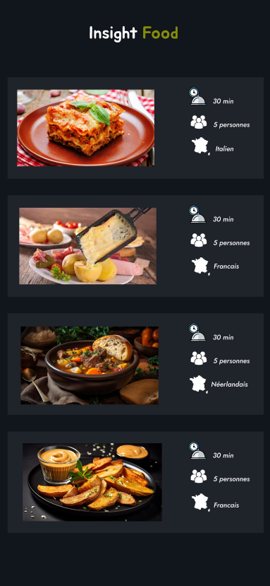

# R411 - Développement pour applications mobiles

## Introduction 

Cette application Android a été développée dans le cadre d'un projet d'équipe SAE à l'IUT de Nantes.  L'objectif principal de cette application est de permettre aux utilisateurs de rechercher des recettes culinaires en utilisant l'API de Spoonacular. 
Inspirée de notre projet web **Insight Galaxy** sur le thème des planètes de Star Wars, **Insight Food** vous propose une expérience de découverte culinaire grâce à l'utilisation de l'API Spoonacular.

## Les vues

Avant de commencer le projet, nous avons décider de modéliser les différentes vues qu'auront accès les différents utilisateurs sur notre application.  C'est donc sur le logiciel <a href="https://www.figma.com/">figma</a> que nous avons pu réaliser les vue suivantes :

### Le préloader
A chaque démarrage de notre application nous avons choisi d'afficher une page de chargement. 
</img>

### Page de recherche 
Puis l'utilisateur peut recherche le plat qu'il souhaite en fonction de certains paramètres ( type de cuisine, quantité de résultats recherchés ).

</img>

### Listes des résultats 
Après avoir recherché une recette, nous obtenons dans une listView la liste de tous nos résultats
 </img>

### Affichage de la recette 

Puis nous affichons plus d'informations dans la vue suivante.
 </img>

## API SPOONACULAR

Il a fallu par la suite regarder plus en détail la documentation de l'api <a href="https://spoonacular.com/food-api">SPOONACULAR</a>. 

Cette API possède de nombreux paramètres et il était important de comprendre quelles étaient les commandes que nous allions utiliser. 

Pour notre application nous choisirons d'utiliser seulement 2 liens :  
Qui possèdent chacun tout ou partie des paramètres suivants :  
* ID => L'identifiant d'une recette de l'api 
* KEY => Notre api key 
* LIMIT => Le nombre maximum de recettes à afficher 
* NOM => le nom de la recette 
* PAYS => Le pays originaire de la recette

 

Ainsi, ce lien permet de renvoyer une liste de recettes en fonction des critères spécifiés, comme le nom de la recette, le pays d'origine, et le nombre maximum de recettes à afficher. 
https://api.spoonacular.com/recipes/complexSearch?apiKey=KEY$request&titleMatch=NOM&cuisine=PAYS&number=LIMIT&addRecipeInformation=true

Ce lien permet de récupérer les informations détaillées d'une recette spécifique (Ingrédients, étapes de préparations, Restrictions alimentaire)  
https://api.spoonacular.com/recipes/ID/analyzedInstructions?apiKey=KEY

### Différentes langues

Notre application est disponible en deux langues différentes, l'*Anglais* et le *Français*, qui ont été définies dans les fichiers *strings.xml* présents dans le dossier `/AndroidApp/app/src/main/res/values` et `/AndroidApp/app/src/main/res/values-en`.

## Les différentes Classes

### Nos Adaptateurs

Nous avons développé plusieurs adaptateurs pour gérer l'affichage et l'interaction avec les éléments de l'interface utilisateur dans notre application Insight Food :

**RecipeRecyclerAdapter**: Ce adaptateur est utilisé avec un RecyclerView pour gérer et afficher les éléments dans la liste de résultats de recherche. Il offre une gestion efficace des éléments de la liste en utilisant une approche de recyclage, ce qui améliore les performances et l'expérience utilisateur.

**CustomSpinnerAdapter**: Ce adaptateur permet une personnalisation avancée de l'arrière-plan et des couleurs d'un spinner dans notre application. Il offre une flexibilité accrue pour adapter l'apparence du spinner selon les besoins de conception de l'application.

### Nos Classes de Données

</img>
*Diagramme de classe des différentes classes de données*

Nous avons également créé plusieurs classes de données pour représenter les différentes entités et informations pertinentes dans notre application :

**Equipment**: Cette classe correspond à un équipement utilisé dans une étape de préparation d'une recette, et comprend également la température associée si nécessaire.

**Ingredient**: Cette classe représente un ingrédient utilisé dans une recette, avec son image associée pour une identification facile.

**Length**: Cette classe correspond à une durée, principalement utilisée pour représenter le temps de préparation d'une recette, avec son unité spécifiée.

**Recipe**: Cette classe encapsule les informations essentielles d'une recette, telles que le titre, les ingrédients, les instructions de préparation, etc.

**RecipesList**: Cette classe nous permet de stocker une liste de recettes (`Recipe`), ainsi que des informations sur le nombre total de recettes spécifiées.

**Step**: Cette classe représente une étape individuelle dans la préparation d'une recette. Elle contient les ingrédients nécessaires pour l'étape, les équipements utilisés, ainsi que les instructions détaillées pour cette étape.

**Temperature**: Cette classe représente une température, avec son unité spécifiée si nécessaire.

**RecipeInstructionsResult**: Cette classe permet de stocker le nom d'une recette avec ses différentes étapes de préparation, facilitant ainsi la gestion et l'affichage des instructions de préparation dans notre application.

## Conclusion

Lors de notre projet, nous avons pu effectuer notre application Android en respectant les différentes contraintes données et avons eu l'opportunité de, par exemple, traduire notre application ou implémenter une écran de chargement.

En conclusion, notre expérience dans le développement de l'application "Insight Food" nous a permis de mettre en pratique nos compétences en matière de développement d'applications mobiles. Nous sommes fiers du résultat final et espérons que notre application pourrait apporter une valeur ajoutée aux utilisateurs à la recherche d'inspiration culinaire et de nouvelles expériences gustatives.