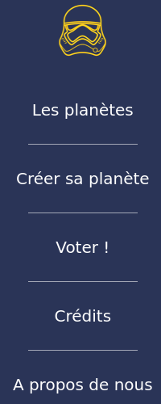
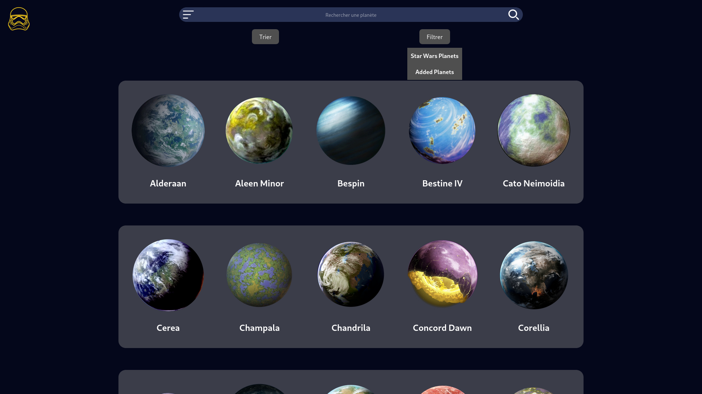
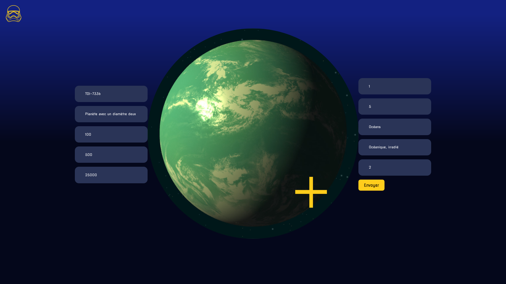
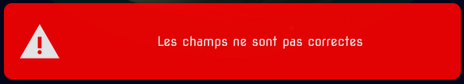
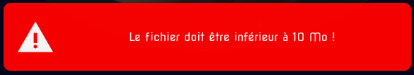
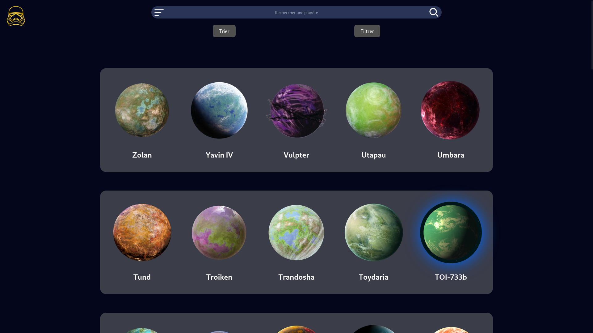
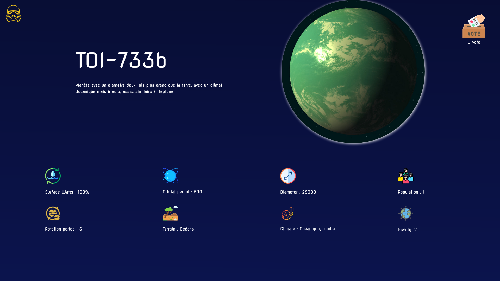
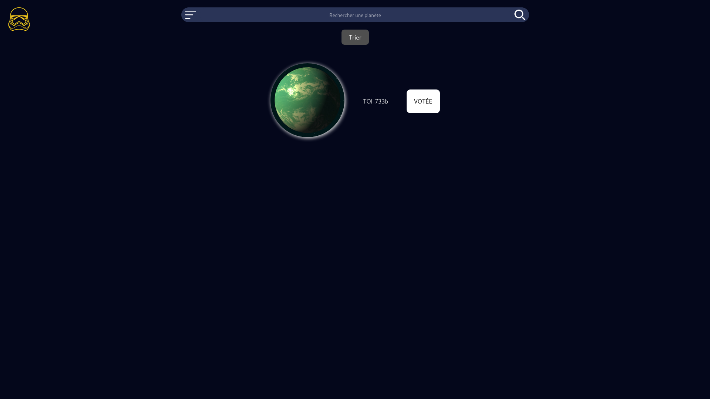
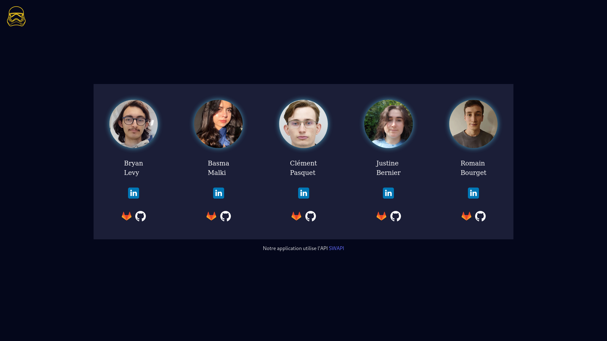
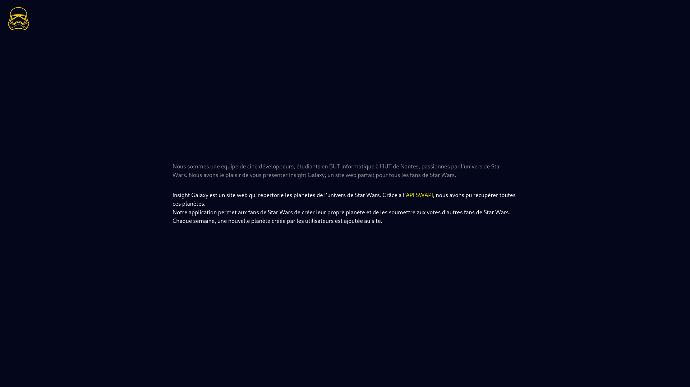

## Sommaire

1. [React + Vite](#react--vite)
2. [Instructions](#instructions)
3. [Présentation de notre site Web](#présentation-de-notre-site-web)
4. [Aperçu visuel de notre projet](#aperçu-visuel-de-notre-projet)

# React + Vite
Ce répertoire contient une configuration de React via Vite, un outil de développement ultra-rapide pour les projets web.


# Instructions

Pour pouvoir lancer le projet, il faut pouvoir lancer le serveur React et notre serveur gérant l'API et notre base de données.

Pour pouvoir lancer le projet react, il faut être dans le dossier `/Web`.
Une fois dans ce répertoire, installez les dépendances avec : : 
```sh 
npm i
```

Pour démarrer le serveur en local : 
```sh
npm run dev
```

[**Pour lancer le serveur API, réferrez vous au README du dossier /API (vous pouvez cliquer ici directement)**](../API/README.md)


## Présentation de notre site Web : 

Notre SAE se porte sur un site web qui affiche les planètes de l’univers de Star Wars et qui permet de rajouter les planètes de notre choix.
En effet, en plus de contenir une soixantaine de planètes officielles de l’univers Star Wars, les utilisateurs ont la possibilité de créer de nouvelles planètes, et de voter pour les planètes proposées par la communauté.

A chaque fin de semaine, le dimanche soir, la planète ajoutée par les utilisateurs la plus votée sera alors ajoutée à notre application.

Un vote unique par ordinateur pour chaque planète proposée est autorisé, car nous stockons l’adresse ip de chaque personnes votant pour une planète.
Bien évidemment à la fin de la semaine, chaque planète qui n’a pas été votée se voit supprimer de notre base de données. Les votes et adresses ip stockés se retrouvent alors tous supprimés.

## Aperçu visuel de notre projet :

Notre site possède **5 pages** : 

* Page d'affichage de toutes les planètes
* Page de création de planète
* Page de vote
* Page de crédit des auteurs
* Page à propos 

<br>

Pour naviguer entre ces pages, notre site propose : 
* Un Menu = 

<br>

La première page est la page d'affichage de toutes les planètes, son but ? 
Afficher toutes les planètes dont nous avons accès, que ce soit les planètes de l'API ( *les planètes sans halo lumineux* ) ou les planètes rajoutés par les utilisateurs ( *les planètes **avec** halo lumineux* ).

Dans la capture d'écran ci dessous, nous n'avons pas encore rajouté de planète.




<br><br>

Pour ce faire, allons dans la page de création de la planète, ici, nous pouvons rajouter une planète avec ses différentes caractéristiques, tel que le nom, la durée de sa période orbitale ( le nombre de jour pour tourner autour du soleil ), son diamètre, son climat ...

Et nous pouvons aussi rajouter une image ! ( de maximum 10 Mo, ndlr )



( Il est à noter qu'après la saisie des champs texte, si une erreur occure, cela sera mentionné dans un message d'erreur sur la même page ) : 





<br><br>

Après l'ajout, notre planète est rajouté à la liste des planètes, mais, pour pouvoir la différencier elle dispose d'un halo lumineux bleu, il est également possible de filtrer sa recherche pour avoir les planètes ajoutées ou non.

Ici, nous pouvons **cliquer** sur la planète pour nous rediriger vers la vue suivante.



<br><br>

Ceci est la page de la planète, présentant les différentes caractéristiques de notre planète. En plus de cela, nous pouvons aussi accéder au ***compteur de vote***, affichant le nombre de vote(s) que cette planète a reçu.




<br><br>

Justement, si nous voulons voter, il faut aller dans la *page des votes*, elle contient toutes les planètes ajoutées par la communauté en plus d'un bouton pour pouvoir le faire.

Si nous le faisons, le bouton "VOTER" ...


... deviendra le bouton "VOTÉE" !



<br><br>

Notre site dispose également de deux pages supplémentaires : 

* La première, la page *Crédits*, nous permet d'accéder aux différents réseaux des créateurs du site.



<br>

* La deuxième, la page *A propos de nous*, nous permet d'accéder à des informations supplémentaires.




